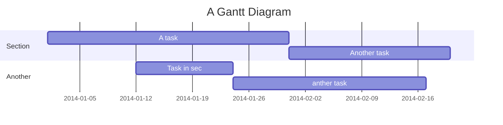

# QA Bot


Project Title
===


## Table of Contents

[TOC]

## Beginners Guide

If you are a total beginner to this, start here!

1. Visit hackmd.io
2. Click "Sign in"
3. Choose a way to sign in
4. Start writing note!

User story
---

```gherkin=
Feature: Guess the word

  # The first example has two steps
  Scenario: Maker starts a game
    When the Maker starts a game
    Then the Maker waits for a Breaker to join

  # The second example has three steps
  Scenario: Breaker joins a game
    Given the Maker has started a game with the word "silky"
    When the Breaker joins the Maker's game
    Then the Breaker must guess a word with 5 characters
```
> I choose a lazy person to do a hard job. Because a lazy person will find an easy way to do it. [name=Bill Gates]


```gherkin=
Feature: Shopping Cart
  As a Shopper
  I want to put items in my shopping cart
  Because I want to manage items before I check out

  Scenario: User adds item to cart
    Given I'm a logged-in User
    When I go to the Item page
    And I click "Add item to cart"
    Then the quantity of items in my cart should go up
    And my subtotal should increment
    And the warehouse inventory should decrement
```

> Read more about Gherkin here: https://docs.cucumber.io/gherkin/reference/

User flows
---
```sequence
Alice->Bob: Hello Bob, how are you?
Note right of Bob: Bob thinks
Bob-->Alice: I am good thanks!
Note left of Alice: Alice responds
Alice->Bob: Where have you been?
```

> Read more about sequence-diagrams here: http://bramp.github.io/js-sequence-diagrams/

Project Timeline
---


> Read more about mermaid here: http://knsv.github.io/mermaid/

## Appendix and FAQ

:::info
**Find this document incomplete?** Leave a comment!
:::

Test
===

[Intent: system_pic](https://www.draw.io/?lightbox=1&highlight=0000ff&edit=_blank&layers=1&nav=1&title=qa_bot%20dialog%20flow.drawio#R7V1bd5u4Fv4t54HHZgHi%2Bmg7TmZOkzbTnDTTeckimNgk2Hgwzu3XHwkQRheDjAGT1NNZrRFCgLT17ftGAqP563nkLGeX4cQLJFWevErgVFJVBagy%2FAe1vKUtum6kDdPIn2SdNg3X%2FruXNWbXTdf%2BxFsRHeMwDGJ%2FSTa64WLhuTHR5kRR%2BEJ2ewgD8q5LZ%2BoxDdeuE7Ctt%2F4knmWtimFvTvzh%2BdNZdmtLNdMT9477NI3C9SK7n6SCh%2BS%2F9PTcwWNlL7qaOZPwpdAExhIYRWEYp7%2FmryMvQHOLpy297mzL2fy5I28Ri1xw85eprHVPvntY3H53tafbR3f1BaSjPDvB2sOvkTxs%2FIYnKHlFDw2iSGDoRG62hnABwXDirGb5uVUchU%2FeKAzCKLkUyMl%2F8MyDHwSF9rGB%2FsD2aeRMfPj8%2BNwiXHj5QHg5VNQxcFZoodFg4dJx%2FRiRG9DhITsP2dQ8e1HsvRaasnk598K5F0dvsEt21rT19JKMhlUtW7OXAkWYWZ9ZgRg0K%2BvoZFQ4zcferAT8kS3GDgujHBcGngEmuS42Z10MwK5Lji57rcvNhRtpL%2B%2Bv79bDT%2B9f%2B7%2BKeiOyLuj1fAgwF869F1yFKz%2F2wwU8dR%2FGcTiHEzOL50G2MrjvIPCnqE8cLtFaZkcunDkv4i2g4Vre%2FQO7gBPHsx5cdMXMWaLnmb9OEW6fOO%2FryDtZrwrDFZexgbXCewavFbtUhsmulNnWQqnsQo11yQaSZSU%2FhpJl%2F4dZOzgwZDxeYQLdIFzD%2BwxfZn7sXUMKR40vcE7JhdxsRjm9OMV6mdoibjj3XdyJXlRFNoHN32bFZc724kO4iPGO15pZQkUn95umMmuIAa%2B4hkZbayjAnZhJHIw1KJRwJ9F79eO%2F0eSfWGZ2%2BCs5NPTs8PQ1W5vk4C07IIHWm0D5IXsAL7gPX8abBmJRQDbOlRf5cD7QzkvHXsC5SZ9DNvFx%2BiAaPtw8SHL0Vjyix9u68KtwHbleNZjFTjT14uq9hN68lIyKsCxzCCVvjLzAif1nUgTjkU92j6vQh%2B%2B2YQsyILFGMcgh0jfPrirKRNRAik6ClkGNk84MM05CzPl716dvjUPfRgAna7gkqNz4d42kxOEcPo4PGcMAntWWr%2FBvufB3QgoyosAvq4QEUTcFoHN4APhrmv2b3Oaee5udhvDrD%2FEn5G5oYtOB4Az69OCw7Z7TtqTbZtH%2BLzLxn7mDYAJGI6i7TvStF0DI9wrPntwG33mL5FAhDYSw30OQ8BfEFziwg47PnLkfILr%2BwwuePTQuybEoyQEqLqrr8tjSxLg3dKMtsSFXILfzHLtLnqM3zHNysCeRXq9A%2Bj15DmZzmLEVbrqVzfF4VX3eogryFq1nvEWlWIJOEZooawGKSo5jn%2BidMhejHeFJ2YWi6ks6%2B9B%2Fs0KSJkjIZs8IWaMUMkOrR8g6Rcj0OC2TscmS8diQLFUaJHrcQJeGp9L4TBqOJGuETtnwhy2NTcnWJHsgjW1pOEBnYWfrTBqcSWNNGg7RhVgIinKGDPsMbWmQ%2FLAG0sAu3MtEo1mQbs%2BYfXRQrfHUGG5jz91ojboin5D2M0VneHiuWnJJvXEubrUDfvBFSY5qCwOgTuBfbfQLo3gWTsOFE9RSO5uDRZOFRc14XD6%2Bny6D9dq8HPqvf1%2BMrrCO2RtYNAyTolaD4svCwGiT1hJFb017LJtZYe0x8Bfel6I2k0ypztdmLKjNJGoMrdDw1TDu3iruoALo0aZJpMq4MyeKTyae668SYykXOAl83Ka%2BFLeChd4aWWGHYTTxIq4xm6voIEP2YorvhEbM3k3JjgtXjdSBro0bglKDIimgn7BYarSkD91%2BO%2F1y%2Fsf6HejfBv5d8Lp4uXnamcqONoqPZqNIhKYzJBCNLSTyDFQk7AwBkpLQDygTKejUEMpBMv4xSsSoAfr%2FU9g2hB1eDezy%2FJIyd6PCkZda2%2BQcZ0ktVrJ9E0flW%2BTw%2FMOZ2BOdQ2478A%2FHwwIkwT%2BaoBjKKAEMlmI65Qp1PDO2nTmdS%2BXrgniNTQ1dydaMZSFpgCcwdjVqbCjjtkWpumzD9kaqph0pgA6MEBWqNcocrNMk3JxQzZ3Yg7tk0OaA0NGEzJM2nK0DhHVzRIvmUDJPK4QZ%2FADdSDTVsyozs2odTsLZzrJo%2BWbuTyYJiLQk4pAwRuso5bagJNLn7Gw04nExWTYMuSm%2BpZC7WTM5ko7GwaUmwkK4%2B7uOe%2BdzMq663p4yflTJt%2Frm7aGN5ExAnzDfogbSaQpumW%2FxvD25%2FkxCLqIEIeDWeVj6y1sV8DAdq0whpjYXBI6YAjIP3tK5TzogInTWcbjKCJUHn1uBdonmNpltfSjppxLX%2Fk1u7qyxxAzPg2aezbgJsLQoWgQsWPKwUm0LKzmuFyykLJ2FEAlpPBJavUESkt1w4iXOlI3kkYz6iQkH47XcNiFZpDDOsS%2Fw4vhaI6Q63hgRpltguVWu6A%2FAPHvDFPOAGzrseufwOgrRAD1Qy0zR7oopfguPPLEdKFNpCtIOyxOxQkPSlDNH9sXF%2FWqZaZsQgW0l%2BQGQnonUTvhb2SiinNiDnTRSioR%2B87h12hPLkZxyC1WRTGg8ao5MBPJEauqZBw5AODy7xFuwUtnsW%2BgBzVdB3dhCeiCtYyMpjggjgrIsFDdlJaFTdhJqhbDOSgKukrybwSCJqpJRHxH0O8ZZ0cEBJkU9nCgrwCFfs4RQ9wO59rxAdUHO6BfINe0dEjWzKb0LRjWooCvNNul4aGGtQrXJodqLu%2BJPLusjGl1ei8lvOopNtcyNILcBySSE1R6w2Hj%2BYzAaw%2Ftd%2FHnDnhxcXIy%2FwZO%2FOOeqMFlGQukm5LUQVTuUk4fMr4IdlCS81kLRtml4LXxHePmecmz21keop5JiyM2iGwoD9bmKQ2xX0JpA2zPHycb5nrII2bS6RftmkZ2TZFCKPf0BdptMxdTVmqiuUbYiHRfg6ArVW8qX2cVIWR3oLUCZj%2Bv5Eg%2BSIVQR7MhtsIcs0jcRw6akAq1mTjDthgGCytUgipy3QrfM9Lb1eXVahzNKH4sOsKGrvVS9Bdkf%2Fkift9k9xHqMkGREbyOSRVfwc3JnKRyC31oCY3vRDNJgmVdDaYBzW2Rop6aznJvnemmPb7fle9kxuXTXjJZ9FK4a6bZNK2ocfj6%2Bi86fly%2FfL6%2Bfv99cvc%2FkaP6ld64fHWgkF7bVumpaHsOTDWXSyV4742jjLH%2B7f%2BiYQfNBM2jUTcYMpjuMeB3ESv978fOfr%2BfO16W6eDwPf03uv%2F4EIiWjqvGQxM9Nn4sQ5VEkjY9eHL9lC4cchiTN0Oi5C%2BgLASEX3zjxzG%2B%2FprZ3P5IXj75y5l6Z36%2Bsrzh8qRIHheFNdMXKnvp3zXl6CAMIKHD7fvktsp9ym5aNPLS2xrF7HVOcdoRhA5DMn1fWpbUUpzJJ65ji1NcUJ8qnqdtGZ2ybSzDbM0GOwUMfI3iILi1lGCxJtRU8xCUpng39GKT9sWiKrhgoH5im6pitO4utbcm2c2KTfv6TvLhU4%2Badssob1d4aWVCt6a74Cc1kqSFEjTuWTNqJABDzwe9qJNeooBelwkrO9M%2FcU02ZvblbkJcn0YiJVdw12v0WVMl4wsJx43uwTJ6vtLBaPduCwKTMU4pS18JKyzcHtbCWTT5VhDur2YYLqmXF25Qk8MTaVHGz0zJshmSdopbBCCnj3HgTS81CabIAlrQI3Gly%2BVDCjsFjdAmmG40ESUNnZRhF45TVbyJcmksnPEN8Awi6S63K1kqu1Yi%2Bbh8V%2BxYaDSjt31CYcqnCgSS6WjVUYx586qHVKhc%2BZRRTyn34hmWX9W9HmOHFdjcjzeTbJJPZzUb3474SjUKKMx1LMxa7b0tdlr3ZuDq120zVqrdtdYrYTcE6s60IM1wf1QE%2ByZPJAFss92jAKyeG9IdMLHDe0WcRZCX5tyW7viLTGCaYadVIhAt3WVi8%2BuGtluECindHsY9cO5Xcq1g5Jmrtc3wydJpSY0vHyx%2F5jfysTXhXKQrvuQuyJUwCZNCdgrMvK74hQYcqN0bXH76IWLFm2G6VwSro8VgVKwViunK0xinzi1PdCZI1WyJZ1jWVfCtOlddIvnAWbs%2B46eFzzmWZNOQBhbOGCuDFODSAO9xIM4F8zJ5HmrVqMSmLPKuMUAOiJpN9XTSWxaRKtpbfyKUiAXfGx6EijVTrlQo6qq%2FW70Vcork0e9KWadO0Bax2%2FHYmFfyN77NN%2B6f7q5Za2t8CoKz%2F3qaxstU8hpD1NITM0Bny5ng22goiK9vYlYUyqG8Mcb9MhGpopE4yMyllayY%2FLDSgbaMc6mMyNT8lSybVQyCz6mFrhTO4VNFaTtZvVRyobMNVcty%2B2dFNm%2F6IlqaBui4wyyS5oyarbUmQZZNboO9LxcYcu0%2BJoE2gCyWJAMtk0KWtjE%2B%2Bm4I1iAvxHBQsYaFwCxRrceQn21fctEkzuoZdXgfjJ40XYuoFY9i6VJXg3rsqGZZBAbJdF9mxVzQvt9FalYzSmS1Qmpnb0fuE7G2m%2BKtUyRM8KQdDfF6YnRji0%2FWdjojPL%2BpAahC6oR4a8VuKmDuqEJvtVMlmcOxDf9iMTCsRpqzVViIsEuYMzMM6MkMLUPjHMUPvtDm4Rug6WQH19wAm7e4T98WI0dQtIWLc1W7N3Ecut0PbVDrYrv1Vvby%2FaezXH6jl%2FekQU6p%2FO3Z0TFwV8kqhZjqqGjxOFFPYCLKPu2d11dOrEktoejlKJihRXj%2B1aKpRmK2xqmmnoqm6PcRrv2%2FIePNlEL553t0iLHxEZmMw917jbaf81Qo9C%2BdMMdallW%2FRROmU9yA9tqNP0ega45IBHNlZ6dIno7YnOwtz5mLJaiaTrlvZuVmPty0oN2ArZW9kZ5vinBqgLCuicjMzkKCo0hR3BRzuekDy3jEAo9fEzSvrV6pC9oa6TVs5oWtKU%2BqcKH1zhsqCL7rSDEVSlPqi%2BO2M7g2TLBC1mWO23H0JttLn%2Frgx1IUEgeOHmOsVWzvGle8kbBsKEzqKkbmL7y27X59%2FKN9t%2FW0WXl%2BcPz28X9553LJrJVY8Rpn56Ga7PZBbZZGbO8WgaeDeYiqiC1doFM20LddySIkpJvHDRzGOE9jteubPcGmJURY1N1QLHzcRcIfxDAQ5osnNWagKMMn5hAsNmNmnV7jfnLn6c8Tur9%2Fad6dTFledk%2FSo8jJW8%2FKUzRcE5mloxzpwH6oOnMEYtjSOYautSnB8stouMh8rVn4MqsprlZcEE7ZFU2WyxbFC%2FumnqZBvaLQc112OxM%2BlcXH5cB3%2B9b%2Fl7ftd%2BPTr4p83PjukFnsK9%2BdS%2FOVV2Q0XC8%2BNM1CRsh2yfeNR6UQ6J4iXl45rtDUn1VOSC3PrKHgbRo77hLQEcZlOqS3TaafoT12ZjvaFsataTiXVhF7Moe5wzQRU3c%2ByZlEYQ1USgSgEQL6au%2B8i5omBzEbkZFSroKU1ZfnfKgiR5IQmDcH3FuGm3xJNkVKKS22wnCenmyKH4ks7Ta04gcS8pHqzJQno5i9TWeuefPewuP3uak%2B3j%2B6KW8ujY%2BZkATqsD1eC64I%2FcWdF5GugnwTr2IUtpZM%2BsCfuA4oUCv8kSybAnvZcw865E%2Fd52eziI3faxp0aWvCumBM8jEKkFW9M6EiRvQwnHurxfw%3D%3D)


Slide
---


###### tags: `AI` `ChatBot` `dialogflow`
